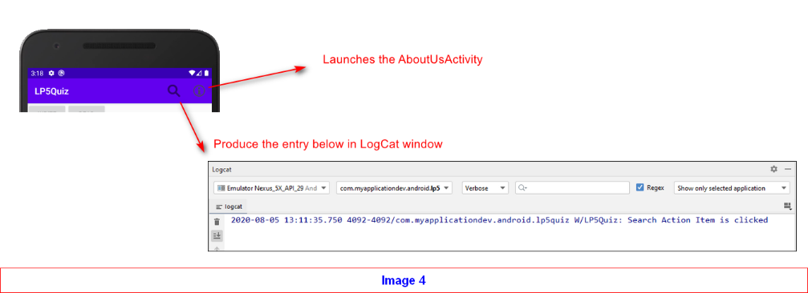

# Practical Quiz for Learning Package 5

This document outlines the information of the Practical Quiz.

This repository contains the skeleton code for the quiz.

### Structure of the quiz

This quiz is released after lesson 11.

The allowed duration for the quiz is **30 mins** (watch your time, please).

### Content of the quiz

The image below shows the UI of the Android App expected to be completed for LP5 Quiz.

#### Tasks

Given below is the list of features to be implemented for the app:

- File writing and reading
  - a file named "data.txt" to be accessed for write/read at the root of the external storage (refer to Image 2)
  - the existing content in the file will not be purged when new data is written
  - the "Write" button writes "My id is 1XXXYYYY" where your ID is part of the written data.
  - the "Read" button reads the content of the file and displayed in the TextView shaded in green
- Upon start, check for the necessary permission, and request for permissions from the user, if not granted yet (Image 3)
  - if the permissions are not granted by the user, the buttons will be disabled
  - if the permissions are granted by the user, the buttons will be enabled
- 2 ActionItems are displayed at the ActionBar (Image 4)
  - the action item with the magnifier icon will create an entry iin the LogCat
  - the action item with the info icon will launch the AboutUsActivity
- At the AboutUsActivity:
  - The button will display a Toast as shown in Image 5
  - The round button will close the currently-displayed Activity

The image below shows the location of the file, to be created in the device.

The image below shows the permission requests and the resultant outcome when the request for permission is granted or denied.

The image below shows the resultant actions when the ActionItems are clicked. The icons are given in the drawables folder.

The image below shows the resultant actions for AboutUsActivity.

The skeletal structure of the app has been given in the repository. You need to study what were given and to complete the rest.

### Deliverables to be submitted

You are to work on the designated repository (in which, this is the one).

You could push your code into your repository regularly and GitHub will do the necessary code tracking.

| Parts                       | Deadline                                                             |
|:----------------------------|:---------------------------------------------------------------------|
| Solution for LP Quiz 5      | Pushed into this repository before you leave the lab                 |

## Plagiarism Warning

In essence, what you submit is your own work, without help from others in anyway (unless cited in the submission).

Refer to the link below, if you need more info.  
<http://intranet.rp.edu.sg/sites/StudentHandbook/SitePages/summative_assessment_rules_and_regulations.aspx>

## Academic Integrity

#### Writing Code

Writing code is similar to academic writing in that <b>when you use or adapt code developed by someone else as part of your project, you must cite your source.</b> However, instead of quoting or paraphrasing a source, you include an inline comment in the code. These comments not only ensure you are giving proper credit, but help with code understanding and debugging.

Src: https://integrity.mit.edu/handbook/writing-code
