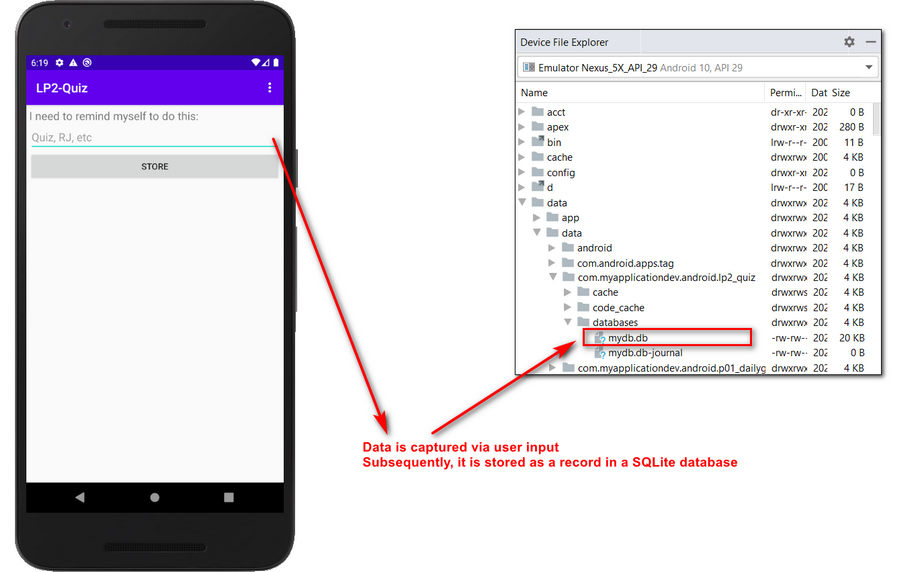
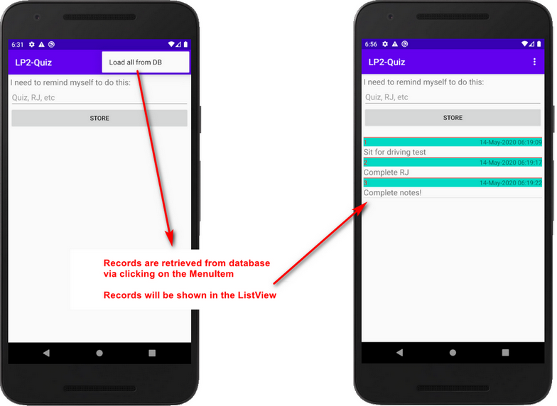
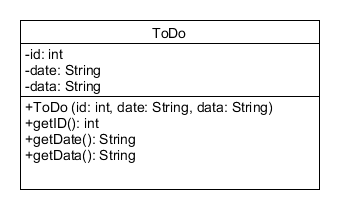

# Practical Quiz for Learning Package 2

This document outlines the information of the Practical Quiz.

This repository contains the skeleton code for the quiz.

### Structure of the quiz
There are 2 parts to this quiz, to be released at different timing:

1. After lesson 4
2. After lesson 5


### Content of the quiz (Part 1 - released after Lesson 4)

You are required to produce a working Android app to allow user to:
- Store records to a SQLite database, and
- Retrieve records from the same SQLite database

The expected app should have something similar to the one shown below:





The skeletal structure of the app has been given in the repository. You need to study what were given and to complete the rest.

The data entered by the user should be structured in an Abstract Data Type, where the class diagram is given below:



You will need to create the database based on the given class diagram above.


The Java code snippet below will return a String that resembles "29-Apr-2020 00:00:00"
```
//Given Java code snippet
protected String getDate(){
    Date c = Calendar.getInstance().getTime();
    SimpleDateFormat df = new SimpleDateFormat("dd-MMM-yyyy HH:mm:ss");
    String formattedDate = df.format(c);
    Log.i("Today's date : ", formattedDate);
    return formattedDate;
}
```


### Requirement for submission

You are to work on your designated repository (in which, this is the one. For clarity, your repository for the quiz should start with [https://github.com/C347-2020/xxxxx] )

The repository is on private access, meaning your friends do not have access to your repository and should remain like this.

You are required to push your code into your repository regularly and GitHub will do the necessary code tracking.

| Parts | Deadline|
|:---|:---|
|Lesson 4 - LP Quiz 2 Part 1|Pushed into repository before Lesson 4|
|Lesson 5 - LP Quiz 2 Part 2|Pushed into repository by 2359 of Lesson 5|

In any case, the deadline for the overall quiz submission is 2359 of Lesson 5.


## Plagiarism Warning

In essence, what you submit is your own work, without help from others in anyway (unless cited in the submission).

Refer to the link below, if you<http://intranet.rp.edu.sg/sites/StudentHandbook/SitePages/summative_assessment_rules_and_regulations.aspx>